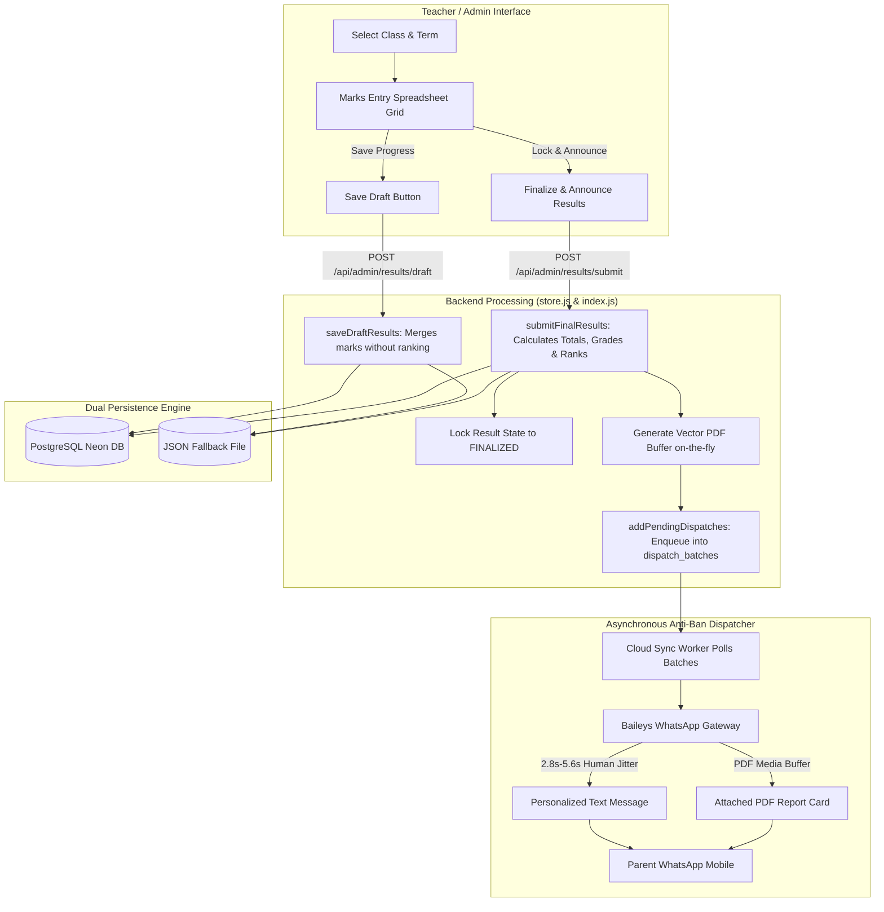
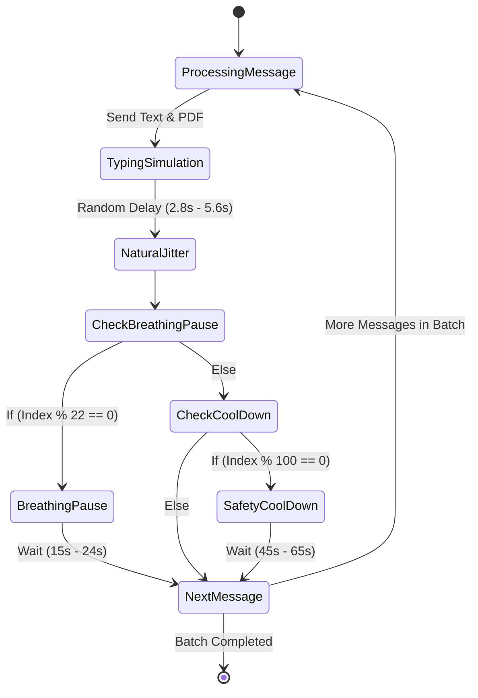

# Academic Results & Digital Marksheet Architecture (`resultdb`)

This document provides a comprehensive, end-to-end architectural specification of the **Academic Results & Digital Marksheets Module** in the Unique Scholars Attendance & School Management System. It details the database design, calculation algorithms, zero-dependency PDF rendering engine, multi-tenant WhatsApp delivery pipeline, role-based access control, and complete API reference.

---

## Table of Contents
1. [System Overview & High-Level Architecture](#1-system-overview--high-level-architecture)
2. [End-to-End Data Flow Architecture](#2-end-to-end-data-flow-architecture)
3. [Database Architecture & Data Models](#3-database-architecture--data-models)
4. [Grading, Percentage & Class Ranking Engine](#4-grading-percentage--class-ranking-engine)
5. [Vector PDF Report Card Engine (`pdfGenerator.js`)](#5-vector-pdf-report-card-engine-pdfgeneratorjs)
6. [WhatsApp Dispatch Pipeline & Anti-Ban Human Pacer](#6-whatsapp-dispatch-pipeline--anti-ban-human-pacer)
7. [API Endpoints & Integration Contracts](#7-api-endpoints--integration-contracts)
8. [Frontend Workflows & User Interfaces](#8-frontend-workflows--user-interfaces)
9. [Role-Based Access Control (RBAC) & Security](#9-role-based-access-control-rbac--security)
10. [Maintenance, Auditing & Troubleshooting](#10-maintenance-auditing--troubleshooting)

---

## 1. System Overview & High-Level Architecture

The Academic Results module automates the entire examination and grading lifecycle for schools:
- **Term & Exam Scheduling**: Administration defines academic terms (e.g., Mid-Term 2026, Final Term 2026).
- **Curriculum & Subject Configuration**: Per-class subject definition with specific maximum marks and passing criteria.
- **Dynamic Marks Entry**: Fast, spreadsheet-style mark entry for faculty on both desktop and mobile devices.
- **Dual-State Lifecycles (`DRAFT` vs `FINALIZED`)**: Allows teachers to incrementally enter and save marks per subject without publishing incomplete results to parents.
- **Automated Class Ranking & Analytics**: Class-wide ranking, cumulative percentage calculation, and standardized letter grades (`A+` down to `F`).
- **Zero-Dependency Vector PDF Generation**: Generates high-definition, official printable A4 report cards in pure binary vector PDF format in under 15ms.
- **Intelligent WhatsApp Telecast**: Asynchronous queuing with human typing jitter and natural breathing pauses to deliver personalized report cards with attached PDF files to parents' WhatsApp without risking phone number bans.

---

## 2. End-to-End Data Flow Architecture



---

## 3. Database Architecture & Data Models

The results subsystem employs dual persistence:
1. **Primary**: PostgreSQL (hosted on Neon Serverless Postgres with connection pooling).
2. **Fallback / Offline**: Flat JSON file store (`backend/data/unique_scholars_db.json`) for zero-dependency local deployment.

### 3.1. `result_terms` (Examination Terms)
Stores defined academic terms (e.g., "Mid-Term Examination 2026").

| Column | Type | Constraints | Description |
| :--- | :--- | :--- | :--- |
| `id` | `VARCHAR(50)` | `PRIMARY KEY` | e.g., `TERM-1789600000` |
| `school_id` | `VARCHAR(50)` | `NOT NULL, FK -> schools(id)` | Multi-tenant school scope |
| `name` | `VARCHAR(100)` | `NOT NULL` | Human-readable name (e.g. "Mid Term 2026") |
| `exam_date` | `VARCHAR(50)` | `NULL` | Scheduled date or date range |
| `description` | `TEXT` | `NULL` | Syllabus or scope notes |
| `status` | `VARCHAR(20)` | `DEFAULT 'Active'` | `'Upcoming'`, `'Active'`, or `'Completed'` |
| `created_at` | `TIMESTAMPTZ` | `DEFAULT now()` | Record creation timestamp |

### 3.2. `class_term_subjects` (Curriculum Structure)
Configures which subjects are taught and evaluated for a specific class in a specific examination term.

| Column | Type | Constraints | Description |
| :--- | :--- | :--- | :--- |
| `id` | `VARCHAR(80)` | `PRIMARY KEY` | Format: `SUB-<classId>-<termId>-<SubjectName>` |
| `school_id` | `VARCHAR(50)` | `NOT NULL, FK -> schools(id)` | Tenant identifier |
| `class_id` | `VARCHAR(50)` | `NOT NULL, FK -> classes(id)` | Target grade/class |
| `term_id` | `VARCHAR(50)` | `NOT NULL, FK -> result_terms(id)` | Associated examination term |
| `subject_name` | `VARCHAR(100)` | `NOT NULL` | Name (e.g., "Mathematics", "English", "Urdu") |
| `max_marks` | `NUMERIC(6,2)` | `DEFAULT 100` | Total maximum score for this subject |
| `display_order` | `INT` | `DEFAULT 0` | Column order in spreadsheet and PDF table |

*Unique Index Constraint*: `UNIQUE (class_id, term_id, subject_name)` prevents duplicate subject definitions within the same class-term pair.

### 3.3. `student_results` (Master Result Card Record)
Holds the evaluated outcome, cumulative metrics, class standing, and locking status for a student in a term.

| Column | Type | Constraints | Description |
| :--- | :--- | :--- | :--- |
| `id` | `VARCHAR(80)` | `PRIMARY KEY` | Format: `RES-<studentId>-<termId>` |
| `school_id` | `VARCHAR(50)` | `NOT NULL, FK -> schools(id)` | School identifier |
| `term_id` | `VARCHAR(50)` | `NOT NULL, FK -> result_terms(id)` | Associated exam term |
| `class_id` | `VARCHAR(50)` | `NOT NULL, FK -> classes(id)` | Student's grade/class |
| `student_id` | `VARCHAR(50)` | `NOT NULL, FK -> students(id)` | Enrolled student identifier |
| `total_obtained` | `NUMERIC(7,2)` | `DEFAULT 0` | Sum of all subject scores obtained |
| `total_max` | `NUMERIC(7,2)` | `DEFAULT 0` | Sum of all subject maximum scores |
| `percentage` | `NUMERIC(5,2)` | `DEFAULT 0` | Computed percentage `(obtained / max) * 100` |
| `grade` | `VARCHAR(5)` | `NULL` | Assigned letter grade (`A+`, `A`, `B`, `C`, `D`, `F`) |
| `pass_status` | `VARCHAR(10)` | `CHECK IN ('PASS', 'FAIL')` | Final pass/fail outcome |
| `class_rank` | `INT` | `NULL` | Position in class (1st, 2nd, 3rd, etc.) |
| `remarks` | `TEXT` | `NULL` | Teacher's personal qualitative feedback |
| `state` | `VARCHAR(10)` | `DEFAULT 'DRAFT'` | `'DRAFT'` (in progress) or `'FINALIZED'` (locked) |
| `updated_at` | `TIMESTAMPTZ` | `DEFAULT now()` | Last edit timestamp |
| `submitted_at` | `TIMESTAMPTZ` | `NULL` | Timestamp when finalized and announced |

*Unique Index Constraint*: `UNIQUE (student_id, term_id)` guarantees one official result statement per student per examination term.

### 3.4. `student_result_marks` (Normalized Subject Scores)
Maintains individual scores per subject linked to the master student result.

| Column | Type | Constraints | Description |
| :--- | :--- | :--- | :--- |
| `id` | `BIGSERIAL` | `PRIMARY KEY` | Auto-incrementing identifier |
| `result_id` | `VARCHAR(80)` | `FK -> student_results(id) ON DELETE CASCADE` | Parent result link |
| `subject_name` | `VARCHAR(100)` | `NOT NULL` | Subject evaluated |
| `obtained` | `NUMERIC(6,2)` | `DEFAULT 0` | Score achieved by student |
| `total` | `NUMERIC(6,2)` | `DEFAULT 100` | Maximum possible score |
| `subject_grade` | `VARCHAR(5)` | `NULL` | Individual subject letter grade |

*Unique Constraint*: `UNIQUE (result_id, subject_name)` prevents duplicate subject entries for the same student result.

---

## 4. Grading, Percentage & Class Ranking Engine

### 4.1. Standardized Grading Scale
The grading engine uses a standardized academic scale implemented in `computeGradeAndStatus(percentage)`:

$$\text{Percentage} = \left(\frac{\sum \text{Marks Obtained}}{\sum \text{Max Marks}}\right) \times 100$$

| Percentage Range | Grade | Outcome | Status Description |
| :--- | :---: | :---: | :--- |
| $\ge 85.0\%$ | **A+** | **PASS** | Outstanding / Distinction |
| $75.0\% \le x < 85.0\%$ | **A** | **PASS** | Excellent Performance |
| $65.0\% \le x < 75.0\%$ | **B** | **PASS** | Very Good Progress |
| $55.0\% \le x < 65.0\%$ | **C** | **PASS** | Satisfactory / Average |
| $40.0\% \le x < 55.0\%$ | **D** | **PASS** | Minimum Pass Threshold |
| $< 40.0\%$ | **F** | **FAIL** | Unsatisfactory / Needs Academic Support |

### 4.2. Class-Wide Auto-Ranking Algorithm
When a teacher or administrator finalizes results via `submitFinalResults()`:
1. All students enrolled in the target class are collected.
2. The system executes a non-destructive marks merge with existing records so partial submissions do not erase previously saved marks.
3. The students are sorted in descending order of cumulative percentage:
   $$\text{Sort Comparator: } \text{Percentage}_B - \text{Percentage}_A$$
4. Positions ($1, 2, 3, \dots, N$) are calculated and assigned to `class_rank`.
5. The transaction updates all records atomically in PostgreSQL, ensuring consistent rank values.

### 4.3. Non-Destructive "Merge-Marks" Architecture
In many schools, different subject teachers input marks at different times. If the English teacher inputs marks on Monday and the Math teacher on Tuesday, the system must not overwrite the English marks.

To ensure safety:
```javascript
// store.js: Non-destructive marks merge algorithm
const existingMarksRows = await trx('student_result_marks').where({ result_id: resId });
const mergedMarks = {};

// 1. Populate already recorded marks
for (const em of existingMarksRows) {
  mergedMarks[em.subject_name] = { obtained: Number(em.obtained), total: Number(em.total) };
}

// 2. Overlay newly submitted subject marks
for (const [subj, m] of Object.entries(item.marks || {})) {
  const obt = typeof m === 'object' && m !== null ? Number(m.obtained ?? 0) : Number(m || 0);
  const tot = typeof m === 'object' && m !== null ? Number(m.total ?? 100) : 100;
  mergedMarks[subj] = { obtained: isNaN(obt) ? 0 : obt, total: isNaN(tot) || tot <= 0 ? 100 : tot };
}
```

---

## 5. Vector PDF Report Card Engine (`pdfGenerator.js`)

Unlike standard web applications that rely on heavy headless browser instances (such as Puppeteer or Chromium, which consume 300MB+ RAM and frequently crash on serverless runtimes), this system uses a **pure vector PDF streaming engine** built from raw PDF 1.4 primitives.

### 5.1. Engine Characteristics
- **Zero External Dependencies**: Pure Node.js `Buffer` operations.
- **Ultra Low Latency**: Renders a complete, production-grade A4 PDF in **under 15 milliseconds**.
- **Serverless Safe**: Compatible with Vercel, AWS Lambda, Docker, and Raspberry Pi with **zero native binary dependencies**.
- **Vector Crispness**: Geometry, tables, and typography use native PostScript vector commands (`re`, `m`, `l`, `Tf`, `Tj`), printing with razor-sharp quality at 1200+ DPI.

### 5.2. Visual Layout Specifications (Standard A4: 595.28 x 841.89 pt)

```
+-------------------------------------------------------------+ (15, 15)
|  +-------------------------------------------------------+  | 
|  | [NAVY BANNER]                                         |  | 
|  | UNIQUE SCHOLARS ACADEMY                               |  |
|  | Main Campus, Phalia Road | Tel: 0315-5889902          |  |
|  | OFFICIAL ACADEMIC RESULT STATEMENT                    |  |
|  +-------------------------------------------------------+  |
|  | [GOLD ACCENT LINE (3pt)]                              |  |
|  +-------------------------------------------------------+  |
|  | [STUDENT CREDENTIAL CARD]                             |  |
|  | Student Name: FATIMA ZAHRA     | Class: Class 9th     |  |
|  | Roll Number:  #14              | Exam:  Mid Term 2026 |  |
|  | Student ID:   STU-000014       | Date:  21 Sep 2026   |  |
|  +-------------------------------------------------------+  |
|  | [ACADEMIC MARKS TABLE]                                |  |
|  | SUBJECT           | MAX MARKS | OBTAINED | %    | GRADE| |
|  | Mathematics       |    100    |    94    | 94%  |  A+  | |
|  | English Literature|    100    |    88    | 88%  |  A+  | |
|  | Physics           |     75    |    68    | 91%  |  A+  | |
|  | Chemistry         |     75    |    62    | 83%  |  A   | |
|  | Biology           |     75    |    70    | 93%  |  A+  | |
|  | ----------------------------------------------------- | |
|  | GRAND TOTAL       |    425    |   382    | 89.9%|  A+  | |
|  +-------------------------------------------------------+  |
|  | [METRIC BADGES]                                        |  |
|  | [Class Rank: #1]    [Status: PASS]   [Grade: A+]      |  |
|  | Teacher Remarks: "Exceptional analytical abilities."   |  |
|  +-------------------------------------------------------+  |
|  |                                                       |  |
|  |  ____________________           ____________________   |  |
|  |   Class Incharge                  Principal Signature |  |
|  +-------------------------------------------------------+  |
+-------------------------------------------------------------+ (580, 826)
```

---

## 6. WhatsApp Dispatch Pipeline & Anti-Ban Human Pacer

Delivering report cards to 500+ parents simultaneously on WhatsApp using automated scripts poses a critical risk of account suspension if done improperly. The system uses a **Human Pacer Engine**:

### 6.1. Asynchronous Decoupled Queue
1. When the teacher clicks **Finalize & Announce**, the HTTP API responds in **< 200ms**.
2. Messages and PDF media are enqueued into `dispatch_batches` with status `'queued'`.
3. The background dispatcher processes the queue continuously without blocking the user interface.

### 6.2. Anti-Ban Human Texting Simulation
The background worker delivers each message with natural timing variation:



1. **Natural Human Delay**: Between every message, the bot waits between $2,800\text{ ms}$ and $5,600\text{ ms}$ with non-linear jitter.
2. **Breathing Pause**: After every **22 consecutive messages**, the worker pauses for $15$ to $24$ seconds to simulate natural typing breaks.
3. **Safety Cool-Down**: After every **100 messages**, the worker enters a cooling pause of $45$ to $65$ seconds.
4. **Deterministic Idempotency**: Each message has a unique MD5 key:
   $$\text{Key} = \text{MD5}(\text{SchoolID} + \text{StudentID} + \text{CleanPhone} + \text{Date} + \text{"results"})$$
   This prevents duplicate report card deliveries even if the system restarts mid-batch.

---

## 7. API Endpoints & Integration Contracts

### 7.1. Examination Terms
- **`GET /api/results/terms?schoolId=:id`**
  - Public/Admin: Lists all scheduled examination terms.
- **`POST /api/admin/results/terms`** *(Admin Only)*
  - Body: `{ schoolId, name, date, description, status }`
  - Creates a new examination term.
- **`DELETE /api/admin/results/terms/:termId`** *(Admin Only)*
  - Cascade-deletes the term, configured subjects, and associated student marks.

### 7.2. Curriculum & Subjects
- **`GET /api/admin/results/subjects?schoolId=:id&classId=:cid&termId=:tid`**
  - Retrieves the ordered list of evaluated subjects with maximum marks.
- **`POST /api/admin/results/subjects`** *(Admin / Assigned Teacher)*
  - Body: `{ schoolId, classId, termId, subjects: [{ subject_name, max_marks, display_order }] }`
  - Saves or updates the subject configuration for a class.

### 7.3. Mark Entry & Submissions
- **`GET /api/admin/results/marks?schoolId=:id&termId=:tid&classId=:cid`**
  - Retrieves student marks for the spreadsheet grid, including total, grade, rank, and state (`DRAFT` vs `FINALIZED`).
- **`POST /api/admin/results/draft`** *(Admin / Assigned Teacher)*
  - Body: `{ schoolId, termId, classId, results: [{ studentId, marks: { Math: 85 }, remarks }] }`
  - Saves progress non-destructively without altering class ranks or triggering parent notifications.
- **`POST /api/admin/results/submit`** *(Admin / Assigned Teacher)*
  - Body: `{ schoolId, termId, classId, results: [...] }`
  - Atomically calculates totals, percentages, letter grades, and class ranks ($1\dots N$), locks records to `FINALIZED`, generates PDF report cards, and enqueues WhatsApp messages.

### 7.4. On-Demand Individual Telecast
- **`POST /api/admin/results/dispatch-individual`**
  - Body: `{ schoolId, resultId, studentId, termId, classId, marks, remarks }`
  - Re-generates a single student's official PDF and sends it directly to the parent's phone.

---

## 8. Frontend Workflows & User Interfaces

The frontend is implemented in Vanilla JS (`backend/public/app.js`) and structured into three primary sub-tabs:

```
+-------------------------------------------------------------------------------+
| 🎓 Academic Results & Digital Marksheets                                       |
| [ 📝 Marks Entry Grid ]   [ ⚙️ Terms & Subjects ]   [ 📜 Finalized History ]   |
+-------------------------------------------------------------------------------+
```

### 8.1. Sub-Tab 1: Marks Entry Grid
- **Selectors**: Class Picker and Term Picker dynamically load available students and subjects.
- **Interactive Spreadsheet**:
  - Pinned column: Student ID, Roll Number, Student Name.
  - Dynamic subject columns: Number inputs for obtained marks.
  - Real-time client-side calculation: Live update of Total Obtained, Percentage, and predicted Grade as the teacher types.
- **Action Buttons**:
  - `💾 Save Draft`: Commits marks without notifying parents.
  - `🚀 Finalize & Announce`: Calculates ranks, locks the session, and triggers PDF generation.

### 8.2. Sub-Tab 2: Terms & Subjects Configuration (Admin View)
- Create and manage exam cycles.
- Add or remove subjects dynamically per class.
- Adjust maximum marks per subject (e.g. 100 for core subjects, 50 or 75 for sciences/arts).

### 8.3. Sub-Tab 3: Finalized Results History & Marksheet Printing
- Filterable archive of all historical examination terms.
- Displays class rankings ($1^{\text{st}}, 2^{\text{nd}}, 3^{\text{rd}}$ badges), percentages, and status.
- **One-Click Actions**:
  - `🖨️ Print / Download PDF`: Opens the high-definition vector PDF result card in a new tab.
  - `📲 Send WhatsApp`: Re-dispatches the official statement to the parent's WhatsApp.

---

## 9. Role-Based Access Control (RBAC) & Security

| Operation / Feature | Administrator | Principal | Class Incharge (Teacher) | Regular Teacher |
| :--- | :---: | :---: | :---: | :---: |
| Create / Delete Exam Terms | ✅ | ✅ | ❌ | ❌ |
| Define Class Subjects & Max Marks | ✅ | ✅ | ✅ *(Assigned Class Only)* | ❌ |
| Enter / Save Draft Marks | ✅ | ✅ | ✅ *(Assigned Class Only)* | ❌ |
| Finalize & Announce to Parents | ✅ | ✅ | ✅ *(Assigned Class Only)* | ❌ |
| View Other Classes' Marksheets | ✅ | ✅ | ❌ | ❌ |
| Download / Print PDF Cards | ✅ | ✅ | ✅ *(Assigned Class Only)* | ❌ |

- Authentication tokens are HMAC-SHA256 signed JWT-style tokens passed via `Authorization: Bearer <token>`.
- Any unauthorized attempt by a teacher to access or modify grades of an unassigned class returns `403 Access Denied`.

---

## 10. Maintenance, Auditing & Troubleshooting

### 10.1. Unlocking a Finalized Result
If a teacher makes a grading error and the marks are already finalized:
1. Navigate to the Marks Entry Grid.
2. Select the Class and Term.
3. Edit the incorrect subject value.
4. Click `💾 Save Draft` or re-run `🚀 Finalize & Announce`. The non-destructive merge will update the score, recalculate percentages, adjust the class rank order, and generate an updated PDF.

### 10.2. Verifying PDF Layout and Buffer Output
To manually inspect a generated PDF card without sending a message to a parent, run:
```javascript
const { generateAcademicResultPdf } = require('./backend/src/services/pdfGenerator');
const fs = require('fs');

const buf = generateAcademicResultPdf({
  schoolName: 'UNIQUE SCHOLARS ACADEMY',
  studentName: 'Muhammad Ali',
  rollNo: 1,
  className: 'Class 10th',
  termName: 'Mid Term 2026',
  marks: { English: { obtained: 92, total: 100 }, Mathematics: { obtained: 98, total: 100 } },
  totalObtained: 190,
  totalMax: 200,
  percentage: 95.0,
  grade: 'A+',
  passStatus: 'PASS',
  rank: 1,
  remarks: 'Brilliant student with consistent focus.'
});

fs.writeFileSync('test_result.pdf', buf);
console.log('PDF generated successfully!');
```

### 10.3. Checking WhatsApp Dispatch Queue Status
To inspect pending, active, or completed report card dispatches directly in the database:
```sql
SELECT id, source, status, jsonb_array_length(media_json) as attachments, created_at, completed_at
FROM dispatch_batches
WHERE source = 'results'
ORDER BY created_at DESC
LIMIT 10;
```
To view individual messages within a batch:
```sql
SELECT student_name, phone, status, queued_at, delivered_at, error_message
FROM dispatch_messages
WHERE batch_id = 'BATCH-XXXX'
ORDER BY queued_at ASC;
```

---

*Document generated and maintained for the Unique Scholars Attendance & School Management System.*
