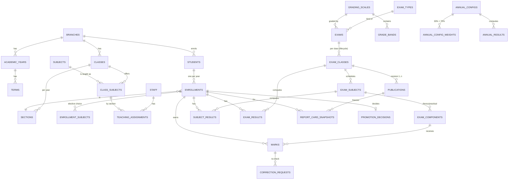

# Examination & Results: PostgreSQL Architecture

Tested on PostgreSQL 16 (uses nothing newer than 15). All scripts run clean from an empty database and the smoke tests pass.

| File | Purpose |
|---|---|
| `01_schema.sql` | Schemas, enums, all tables, constraints, indexes |
| `02_functions.sql` | Guards, calculation, ranking, lifecycle, publish + snapshots, corrections, audit triggers, views |
| `03_security.sql` | App role, grants, Row-Level Security |
| `04_seed.sql` | Demo data that exercises grace, absent, exempt, fail, lifecycle, annual result |
| `05_queries.sql` | Ten ready-to-use queries |
| `06_tests.sql` | Integrity + RLS smoke tests |

Run order: `01 → 02 → 03 → 04`. Skip 04 in production.

---

## 0. Architecture in one paragraph

Teachers enter **raw marks** (`exams.marks`). The database **calculates** subject and exam results from those marks and a **versioned grading scale**. An exam moves through `DRAFT → SUBMITTED → VERIFIED → PUBLISHED → LOCKED`. On **publish**, every student's full report card is frozen as a JSON **snapshot** (name, class, roll no., subjects, marks, grading bands, rank, school details). A year later you read the snapshot, not the live tables, so nothing that changed since can alter what was issued. Fixing a published mark creates **revision 2**; revision 1 is kept forever. Every change to marks is written to an append-only audit log.

**Principles:** results attach to *enrollment* (student + year), never to the student · absent ≠ 0 · never overwrite published data · never hard-delete · the DB refuses illegal states rather than trusting the app.

---

## 1. Assumptions and questions for you

**Assumptions I made**
- One DB serves several campuses (`branch_id`). Single-school is just one row.
- Marks are entered per **component** (theory, practical…) and a subject total is the sum of components.
- Pass rule: subject percentage ≥ `exam_subjects.pass_percent` (default 33), **and** every component flagged `must_pass` reaches its `pass_marks`.
- Only **PASS** students get a rank. A failing or incomplete student has none.
- Overall status: any withheld subject → `WITHHELD`; any absent/medical → `INCOMPLETE`; any fail → `FAIL`; else `PASS`.
- Auth lives outside the DB; your backend passes the user id and role per request.

**Please decide (they change details, not the shape)**
1. Do failed students get a rank in your school? (One-line change in `compute_exam_results`.)
2. Is GPA credit-weighted, or a plain average? (I use `class_subjects.credit_hours`; default 1 = plain average.)
3. Can a subject pass with a failed practical? (`must_pass` per component controls it.)
4. Are grace marks a school policy or a board policy? (`exam_classes.grace_limit`.)
5. Backend stack and expected volume (see §7, you almost certainly don't need partitioning yet).

---

## 2. ER model



**Three-layer separation**, the key idea:

| Layer | Tables | Nature |
|---|---|---|
| Configuration | exam_types, grading_scales, grade_bands, exams, exam_classes/subjects/components | Defines the rules. Frozen once the exam leaves DRAFT |
| Raw data | marks, correction_requests | Only thing teachers touch |
| Derived + permanent | subject_results, exam_results, annual_results → **publications + report_card_snapshots** | Derived tables can be recomputed; snapshots are the permanent record |

---

## 3. DDL decisions (full DDL in `01_schema.sql`)

- **BIGINT identity, not UUID.** 8 bytes vs 16, faster joins, smaller indexes, and this is an internal system. If you expose IDs in URLs, add a separate `public_id UUID` column rather than making every FK a UUID.
- **NUMERIC(6,2) for marks, NUMERIC(5,2) for percentages.** Never float: `0.1 + 0.2` errors in report cards are unacceptable.
- **Enums only for tiny stable sets** (lifecycle status, mark status, result status). **Lookup tables for anything a school may customise** (exam types, component types) so no migration is needed to add "Pre-Board".
- **Schemas:** `core` (people/structure), `exams` (config + marks), `results` (calculated/published), `audit`, `app` (helpers). Makes grants and future extraction cleaner.
- **`ON DELETE RESTRICT` almost everywhere.** Academic history must never disappear by cascade. The only `CASCADE` is `user_students` (a portal login link).
- **Absent ≠ 0.** `CHECK` on `marks`: `PRESENT` ⇒ score required (0 allowed); any other status ⇒ score must be NULL.
- **Grade bands can't overlap**: a `btree_gist` exclusion constraint on the percentage range per scale.
- **Enrollment uniqueness:** `UNIQUE (student_id, year_id)`; `UNIQUE (branch_id, admission_no)` guards against duplicate students.
- **Standard columns:** `created_at/updated_at` on mutable tables (auto-touched by trigger), `deleted_at` on people/structure tables. I did **not** add `created_by/updated_by` to every table: for marks and configuration the audit log records the actor, which is more reliable than a column the app might forget to fill.

---

## 4. Historical integrity (the critical part)

### 4.1 Snapshots
`results.publish_exam_class()` writes one row per student into `results.report_card_snapshots` with a JSONB `payload` containing school, year, exam, student identity, class, section, roll no., every subject and component with marks/grade/status, the **grading bands used**, summary and rank, plus a `sha256` hash. Snapshots and publications are protected by an immutability trigger (UPDATE/DELETE raise).

Consequence: rename a subject, move a student, change the grading scale, delete a teacher. The 2025-26 Midterm card still prints exactly as issued. The hash lets you verify a printed card later (query 8).

### 4.2 Versioning
- **Grading scales**: `name + version + effective_from/to`. A trigger blocks any edit to `grade_bands` of a scale used by a PUBLISHED/LOCKED exam. Change rules by creating **version 2** and pointing new exams at it.
- **Exam structure** (components, max/pass marks) is frozen once the exam leaves DRAFT.

### 4.3 Lifecycle: what can change when

| State | Who may edit marks | Structure editable | Next |
|---|---|---|---|
| DRAFT | teacher (own subject/section), exam controller, admin | yes | SUBMITTED (blocked if any mark is missing) |
| SUBMITTED | exam controller / admin | no | VERIFIED, or back to DRAFT with reason |
| VERIFIED | exam controller / admin | no | PUBLISHED (results calculated), or back to DRAFT |
| PUBLISHED | **nobody directly.** Only via `exams.apply_correction()` | no | LOCKED, or re-publish as revision N+1 |
| LOCKED | **nobody, ever** (even admin) | no | terminal |

### 4.4 Corrections
`correction_requests` → approver calls `exams.apply_correction()` → in **one transaction**: mark updated (audit records old/new + reason), results recalculated, **revision 2 published** with the reason. Revision 1 stays. Tested: Usman's Maths 12 → 22 flipped his midterm FAIL → PASS in revision 2 while revision 1 still shows FAIL.

### 4.5 Deletion and retention
No hard deletes of academic data (FKs are RESTRICT). Marks can only be deleted while DRAFT. Use `ABSENT/EXEMPT/...` statuses instead of deleting. Keep results **indefinitely**; they're tiny. Purge policy only for personal data on withdrawn students, per your local law.

---

## 5. Audit and security

**Audit:** `audit.log_change()` trigger on marks, exam_classes, components, grade_bands, correction_requests, enrollments, promotion_decisions. Records old/new row as JSONB, actor, time, reason, IP, source. The table is append-only (trigger blocks UPDATE/DELETE) and readable only by admin/principal.

Your backend sets per transaction (pool-safe):
```sql
SET LOCAL app.user_id = '<uuid>';  SET LOCAL app.role = 'teacher';
SET LOCAL app.reason  = 'Re-check';  SET LOCAL app.client_ip = '10.0.0.5';  SET LOCAL app.source = 'web';
```

**Roles and RLS (`03_security.sql`)**

| Role | Marks | Calculated results | Snapshots | Workflow |
|---|---|---|---|---|
| teacher | only own subject **and** section | own subjects/sections | n/a | may SUBMIT |
| exam_controller | all | all | all | verify, publish, corrections |
| principal | all | all | all | verify, publish, **lock**, read audit |
| admin | all | all | all | everything, read audit |
| parent / student | none | own child, **published only** | own child only | none |

Verified by test: a Maths teacher's UPDATE on English marks touches 0 rows; a parent sees 0 raw marks and exactly their own child's 2 snapshots.

**Important:** RLS is bypassed by superusers and table owners. The backend must connect as `sms_app` (or a role that inherits it), never as the owner.

**Sensitive data:** date of birth and father's name are in the snapshot. Encrypt backups, restrict `audit.change_log` (contains old/new values), and apply TLS + column-level controls per your regulations.

---

## 6. Business logic: DB vs application

**In the DB (integrity, must never be bypassed):** range validation, lifecycle state machine, lock enforcement, calculation, ranking, snapshot creation, audit, role checks on workflow functions.

**In the app:** login, UI, PDF rendering, Excel parsing, notifications, wording of remarks, school policy screens.

Key functions: `compute_subject_results` → `compute_exam_results` → `publish_exam_class` (atomic, row-locked with `FOR UPDATE`, so two people can't publish simultaneously), `compute_annual` (weights must total 100; missing exam ⇒ `INCOMPLETE`, never silently re-weighted).

**Ranking: `RANK()`, not `DENSE_RANK()`.** With two students tied for 2nd, `RANK` gives 1,2,2,4 (the convention school "position in class" follows). `DENSE_RANK` gives 1,2,2,3; use it only for prize tiers.

---

## 7. Performance and scale

**Sizing:** 2,000 students × 15 subjects × ~2 components × 5 exams ≈ **300k mark rows/year**, 3M in ten years. That is small for PostgreSQL. **Do not partition yet.**

**Indexes (all present):**

| Query | Index |
|---|---|
| Report card for a student | `report_card_snapshots (student_id, year_id)`, index-only scan confirmed |
| Class result sheet / ranks | `exam_results (exam_class_id, class_rank)` |
| Mark entry screen | `marks` UNIQUE `(component_id, enrollment_id)` |
| All marks of a student | `marks (enrollment_id)` |
| Class list | `enrollments (year_id, class_id, section_id)` |
| Audit lookup | `(table_name, record_pk, changed_at DESC)`; BRIN on time |

**Materialized view** `results.mv_subject_stats` (pass %, average, top per subject) has a unique index so it can `REFRESH MATERIALIZED VIEW CONCURRENTLY`. Refresh after each publish (or nightly).

**When to partition:** beyond roughly 50-100M rows in `marks` / `audit.change_log`. Then partition `audit.change_log` by month and `marks` by `year_id` (this requires adding `year_id` to the PK/unique keys, which is why it is a planned migration, not a day-one default).

---

## 8. Archival and long-term retention

- **Results don't need archiving to stay fast.** Snapshots are indexed by student and year, so a lookup from 2016 costs the same as one from today.
- If the DB ever grows: partition, then `DETACH PARTITION` old years into an `archive` schema or a cheaper tablespace. They remain queryable.
- **Backups:** WAL archiving + base backups (pgBackRest or WAL-G) for **point-in-time recovery**; keep 30 days PITR plus yearly full backups indefinitely. **Test a restore every quarter**, since an untested backup isn't a backup.
- **Exports:** at year end (or on LOCK) export snapshots as JSON files to object storage. Because the snapshot is self-contained, this is a complete, database-independent archive. Render PDFs from the JSON in the app and store the PDF alongside its `payload_hash`.

---

## 9. Ready-to-use queries

In `05_queries.sql`, all executed against the seed data: report card (JSON and flat), class result sheet with ranks, subject pass % and toppers (ties kept), performance trend, multi-year transcript, students needing re-exam, audit history of a mark, hash verification of a printed card, revision diff, and "who is still missing marks".

---

## 10. Migrations and seed

```
db/
  migrations/
    001_schema.sql        (01_schema.sql)
    002_functions.sql     (02_functions.sql)
    003_security.sql      (03_security.sql)
  seed/
    dev_seed.sql          (04_seed.sql, never in production)
  tests/
    smoke.sql             (06_tests.sql)
```

Use Flyway, Sqitch, Alembic, Prisma Migrate or your framework's tool, so long as migrations are forward-only and versioned. Make sure production migration runs as the owner and the app connects as `sms_app`.

---

## 11. Edge cases

| Case | How it is handled |
|---|---|
| Student changes section mid-year | Update `enrollments.section_id`, log in `enrollment_history`. `exam_results.section_id` records the section **at calculation time**, and the snapshot freezes it |
| Transfer in / out | Set `enrollments.status` and `left_on`. Results already published stay intact |
| Subject added/removed mid-year | Add/remove `exam_subjects` while the exam is DRAFT. Frozen afterwards |
| Re-exam / supplementary | Create a new `exam_type` (`SUPPLEMENTARY`) and an exam for the failed students; the original result stays untouched |
| Grace marks | `marks.grace_marks` + mandatory reason, capped by `exam_classes.grace_limit`, shown separately in the snapshot |
| Elective subjects | `class_subjects.is_elective` + `enrollment_subjects`; `missing_marks()` only expects marks from students who chose it |
| Different exam structure per class | Structure is per `exam_classes → exam_subjects → exam_components`, so Grade 8 and Grade 10 can differ |
| Grading rules change between years | New scale **version**; old exams keep pointing at the old one; snapshot embeds the bands used |
| Result withheld | `WITHHELD` mark status ⇒ subject and exam `WITHHELD`, no grade or rank; publish later via correction |
| Medical leave | `MEDICAL_LEAVE` ⇒ `INCOMPLETE` until a re-exam mark is entered |
| Exempt component | `EXEMPT` removes it from the denominator (tested: Ayesha's practical) |
| Duplicate students | `UNIQUE (branch_id, admission_no)`; merge duplicates by re-pointing enrollments in a controlled script + audit |
| Timezones | `TIMESTAMPTZ` everywhere (stored UTC); `branches.timezone` for display; dates such as exam dates are plain `DATE` |
| Bulk marks import | `COPY` into an unlogged **staging table** → validate (unknown roll numbers, max marks, duplicates) → `INSERT … ON CONFLICT (component_id, enrollment_id) DO UPDATE` inside one transaction. The guard trigger and audit still fire, so imports get the same protection as manual entry. Set `app.source = 'import'` |

---

## What is and isn't done

**Implemented and tested:** everything above except the items below.

**Deliberately left for later (not needed for MVP):**
- Table partitioning (not needed at your scale; approach in §7).
- Branch-level tenant isolation in RLS. Currently RLS separates *roles*; if several campuses share the DB, add `branch_id = app.current_branch()` policies.
- A packaged bulk-import function (pattern in §11).
- Annual result snapshots (only per-exam report cards are frozen; the annual result is recomputable from the frozen exams, but if you issue annual certificates, snapshot them the same way).
- `created_by/updated_by` columns on every table (see §3).

**MVP vs later:** MVP = `01-03` as provided. Later = partitioning, branch RLS, annual snapshots, import function, promotion workflow UI.
